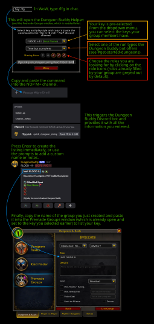

# DungeonBuddyHelper

This is an addon for World of Warcraft to help create a group for the DungeonBuddy bot on the "No Pressure" discord server.

## How to use

To use just type `/lfg` or `/dbh` to create a DungeonBuddy-Command for the key in your bags and the current group composition.
You can also paste a key after the command with <kbd>Shift</kbd>+<kbd>Left Click</kbd> to use this key instead.

Afterwards, copy and paste the command in the appropriate discord channel. Use the bots generated group name for your listing ingame.

Set an optional custom group name to include it in the bot command as `listed_as`.
Select party members' keys shared through LibOpenRaid/BigWigs, KeystoneLoot replies to `!keys`, or AlterEgo's character-labelled links.

## Infographic

